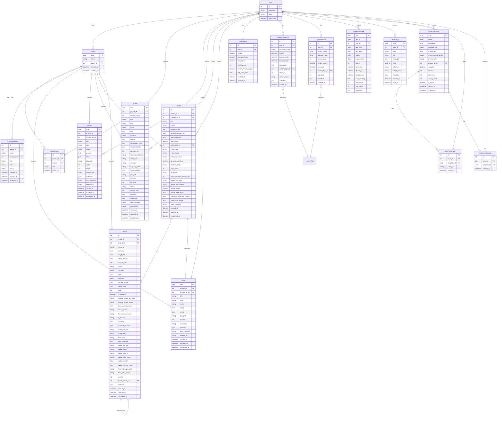

# Modelo de Datos - Atenea

## Diagrama del Modelo de Datos



## Descripción Técnica del Modelo de Datos

### 1. Modelos Principales de Contenido

#### 1.1 Project (Proyecto)
**Propósito**: Agrupa recursos multimedia (videos, imágenes, audios, guiones) en unidades lógicas de trabajo.

**Campos Clave**:
- `uuid`: Identificador único público (UUID)
- `name`: Nombre del proyecto
- `owner`: Usuario propietario (ForeignKey a User)
- `shared_with`: Relación ManyToMany con User a través de ProjectMember

**Relaciones**:
- `videos`: Videos del proyecto (reverse FK)
- `images`: Imágenes del proyecto (reverse FK)
- `audios`: Audios del proyecto (reverse FK)
- `scripts`: Guiones del proyecto (reverse FK)
- `scenes`: Escenas del proyecto (reverse FK)
- `members`: Miembros del proyecto (ProjectMember)
- `invitations`: Invitaciones pendientes (ProjectInvitation)

**Propiedades Computadas**:
- `video_count`, `image_count`, `script_count`, `scene_count`: Contadores de recursos
- `completed_videos`, `completed_images`, `completed_scripts`, `completed_scenes`: Contadores de recursos completados

**Índices**: `uuid` (db_index=True)

---

#### 1.2 Video
**Propósito**: Representa videos generados por servicios de IA (HeyGen, Gemini Veo, Sora, Kling, etc.).

**Campos Clave**:
- `uuid`: Identificador único público
- `project`: Proyecto al que pertenece (nullable)
- `created_by`: Usuario creador
- `title`: Título del video
- `type`: Tipo de servicio usado (choices: VIDEO_TYPES)
- `status`: Estado del procesamiento (pending, processing, completed, error)
- `script`: Guión del video
- `config`: Configuración específica del servicio (JSON)
- `gcs_path`: Ruta en Google Cloud Storage
- `duration`: Duración en segundos
- `resolution`: Resolución del video
- `metadata`: Metadatos adicionales (JSON)
- `external_id`: ID en la plataforma externa

**Estados del Ciclo de Vida**:
- `pending` → `processing` → `completed` / `error`

**Métodos Principales**:
- `mark_as_processing()`: Transición a procesamiento
- `mark_as_completed()`: Completa el video y cobra créditos automáticamente
- `mark_as_error()`: Marca como error

**Índices**: `uuid` (db_index=True), ordenamiento por `-created_at`

---

#### 1.3 Image
**Propósito**: Representa imágenes generadas por IA (principalmente Gemini).

**Campos Clave**:
- `uuid`: Identificador único público
- `project`: Proyecto al que pertenece (nullable)
- `created_by`: Usuario creador
- `title`: Título de la imagen
- `type`: Tipo de generación (text_to_image, image_to_image, multi_image)
- `status`: Estado del procesamiento
- `prompt`: Prompt descriptivo
- `config`: Configuración (aspect_ratio, response_modalities, etc.)
- `gcs_path`: Ruta en GCS
- `width`, `height`: Dimensiones en píxeles
- `aspect_ratio`: Relación de aspecto
- `metadata`: Metadatos adicionales
- `external_id`: ID en Gemini

**Métodos**: Similar a Video (`mark_as_processing`, `mark_as_completed`, `mark_as_error`)

---

#### 1.4 Audio
**Propósito**: Modelo unificado para audios TTS (Text-to-Speech) y música generada (ElevenLabs).

**Campos Clave**:
- `uuid`: Identificador único público
- `project`: Proyecto al que pertenece (nullable)
- `created_by`: Usuario creador
- `title`: Título del audio
- `type`: Tipo ('tts' o 'music')
- `status`: Estado del procesamiento

**Campos TTS** (nullable si type='music'):
- `text`: Texto para convertir a voz
- `voice_id`: ID de voz en ElevenLabs
- `voice_name`: Nombre de la voz
- `model_id`: Modelo de ElevenLabs usado
- `language_code`: Código de idioma (ISO 639-1)
- `voice_settings`: Configuración de voz (JSON)

**Campos Music** (nullable si type='tts'):
- `prompt`: Prompt para generar música
- `composition_plan`: Plan de composición (JSON)
- `song_metadata`: Metadatos de la canción (tempo, key, mood)
- `duration_ms`: Duración en milisegundos
- `elevenlabs_track_id`: ID del track en ElevenLabs Music

**Campos Comunes**:
- `gcs_path`: Ruta en GCS
- `duration`: Duración en segundos
- `file_size`: Tamaño del archivo
- `format`: Formato (mp3, wav, etc.)
- `sample_rate`: Sample rate del audio
- `alignment`: Datos de sincronización carácter por carácter (JSON)
- `metadata`: Metadatos adicionales
- `external_id`: ID en ElevenLabs

**Métodos**: Similar a Video/Image

---

#### 1.5 Script (Guión)
**Propósito**: Representa guiones procesados por n8n que se convierten en videos mediante el agente de creación.

**Campos Clave**:
- `project`: Proyecto al que pertenece (nullable)
- `created_by`: Usuario creador
- `title`: Título del guión
- `status`: Estado del procesamiento
- `original_script`: Guión original enviado
- `desired_duration_min`: Duración deseada en minutos
- `processed_data`: Datos procesados por n8n (JSON con project, scenes, etc.)

**Configuración del Agente**:
- `agent_flow`: Si fue creado por el flujo del agente
- `final_video`: Video final combinado generado
- `video_type`: Tipo de video (ultra, avatar, general)
- `video_format`: Formato (social, educational, longform)
- `video_orientation`: Orientación (16:9, 9:16)
- `generate_previews`: Si se generan previews automáticamente

**Configuración de Audio**:
- `default_voice_id`: ID de voz por defecto de ElevenLabs
- `default_voice_name`: Nombre de voz por defecto
- `enable_audio`: Si se genera audio automáticamente

**Preferencias y Estilo**:
- `model_preferences`: Preferencias de modelos por servicio (JSON)
- `character_reference_images`: Imágenes de referencia de personajes (JSON)
- `visual_style_guide`: Guía de estilo visual compartida (JSON)

**Metadatos del Procesamiento**:
- `platform_mode`: Modo de plataforma
- `num_scenes`: Número de escenas
- `language`: Idioma del guión
- `total_estimated_duration_min`: Duración total estimada

**Propiedades**:
- `scenes`: Escenas del guión (desde processed_data)
- `project_data`: Datos del proyecto (desde processed_data)

**Métodos**:
- `get_model_preference(service)`: Obtiene preferencia de modelo para un servicio
- `get_character_description(character_id)`: Obtiene descripción de personaje
- `get_all_characters()`: Retorna todos los personajes

---

#### 1.6 Scene (Escena)
**Propósito**: Representa escenas individuales dentro de un guión procesado por el agente.

**Campos de Relación**:
- `script`: Guión al que pertenece (ForeignKey)
- `project`: Proyecto (para consultas directas, nullable)

**Datos de la Escena** (desde n8n):
- `scene_id`: ID de la escena (ej: "Escena 1")
- `summary`: Resumen breve
- `script_text`: Texto literal para narración (HeyGen + ElevenLabs)
- `visual_prompt`: Prompt visual para generar video (Veo/Sora/Vuela) - en inglés
- `duration_sec`: Duración en segundos
- `avatar`: Si tiene avatar visible (si/no)
- `platform`: Plataforma sugerida por n8n
- `broll`: Lista de elementos visuales sugeridos (JSON)
- `transition`: Tipo de transición
- `text_on_screen`: Texto para mostrar en pantalla
- `audio_notes`: Notas sobre tono, música y efectos

**Control de Inclusión**:
- `order`: Orden en la secuencia del video
- `is_included`: Si está marcada para incluir en el video final

**Preview Image**:
- `preview_image_gcs_path`: Ruta de la imagen preview
- `preview_image_status`: Estado de generación
- `preview_image_error`: Mensaje de error
- `image_source`: Origen (ai_generated, freepik_stock, user_upload)
- `freepik_resource_id`: ID del recurso de Freepik si se usó stock

**Configuración de IA**:
- `ai_service`: Servicio seleccionado (gemini_veo, sora, heygen, etc.)
- `ai_config`: Configuración específica del servicio (JSON)

**Continuidad Cinematográfica**:
- `continuity_context`: Contexto de continuidad con otras escenas (JSON)

**Video Generado**:
- `video_gcs_path`: Ruta del video generado
- `video_status`: Estado de generación
- `external_id`: ID en plataforma externa
- `error_message`: Mensaje de error

**Audio Generado** (para escenas Veo/Sora):
- `audio_gcs_path`: Ruta del audio narrado (ElevenLabs TTS)
- `audio_status`: Estado de generación
- `audio_voice_id`, `audio_voice_name`: Voz usada
- `audio_duration`: Duración del audio
- `audio_error_message`: Mensaje de error

**Video Final Combinado**:
- `final_video_gcs_path`: Ruta del video final (video + audio)
- `final_video_status`: Estado de combinación

**Versionado**:
- `version`: Versión de la escena (incrementa con regeneración)
- `parent_scene`: Escena padre si es versión regenerada (self-referencing FK)

**Métodos Principales**:
- `mark_preview_as_generating/completed/error()`: Gestión de preview
- `mark_video_as_processing/completed/error()`: Gestión de video
- `mark_audio_as_processing/completed/error()`: Gestión de audio
- `mark_final_video_as_processing/completed/error()`: Gestión de video final
- `needs_audio()`: Determina si necesita audio
- `needs_combination()`: Determina si necesita combinar video+audio

**Constraints**: `unique_together = ['script', 'scene_id']`

---

### 2. Modelos de Colaboración

#### 2.1 ProjectMember
**Propósito**: Tabla intermedia para la relación ManyToMany entre Project y User con roles.

**Campos**:
- `project`: Proyecto (ForeignKey)
- `user`: Usuario (ForeignKey)
- `role`: Rol ('owner' o 'editor')
- `joined_at`: Fecha de unión

**Constraints**: `unique_together = ['project', 'user']`

---

#### 2.2 ProjectInvitation
**Propósito**: Invitaciones pendientes para unirse a proyectos.

**Campos**:
- `project`: Proyecto al que se invita
- `email`: Email del usuario invitado
- `invited_by`: Usuario que envió la invitación
- `role`: Rol que se asignará
- `token`: Token único para aceptar (unique)
- `status`: Estado (pending, accepted, expired, cancelled)
- `created_at`: Fecha de creación
- `expires_at`: Fecha de expiración
- `accepted_at`: Fecha de aceptación

**Métodos**:
- `is_expired()`: Verifica si expiró
- `can_be_accepted()`: Verifica si puede ser aceptada

**Índices**: `token`, `['email', 'status']`

---

### 3. Modelos de Créditos y Facturación

#### 3.1 UserCredits
**Propósito**: Saldo de créditos por usuario (OneToOne con User).

**Campos**:
- `user`: Usuario (OneToOne)
- `credits`: Saldo actual (Decimal)
- `total_purchased`: Total comprado históricamente
- `total_spent`: Total gastado históricamente
- `monthly_limit`: Límite mensual (default: 1000)
- `current_month_usage`: Uso del mes actual
- `last_reset_date`: Última fecha de reset mensual

**Propiedades**:
- `credits_remaining`: Créditos restantes del mes
- `usage_percentage`: Porcentaje de uso mensual

**Métodos**:
- `reset_monthly_usage()`: Resetea el uso mensual

---

#### 3.2 CreditTransaction
**Propósito**: Historial de transacciones de créditos (auditoría).

**Campos**:
- `user`: Usuario
- `transaction_type`: Tipo (purchase, spend, refund, adjustment, monthly_reset)
- `amount`: Cantidad (positivo para compras, negativo para gastos)
- `balance_before`: Saldo antes
- `balance_after`: Saldo después
- `description`: Descripción
- `related_object`: Relación genérica al recurso relacionado (GenericForeignKey)
- `service_name`: Nombre del servicio usado
- `metadata`: Información adicional (duración, tokens, etc.)

**Índices**: `['user', '-created_at']`, `['user', 'transaction_type']`, `['service_name', '-created_at']`

---

#### 3.3 ServiceUsage
**Propósito**: Tracking detallado de uso por servicio para análisis y facturación.

**Campos**:
- `user`: Usuario
- `service_name`: Servicio (gemini_veo, sora, heygen, etc.)
- `operation_type`: Tipo de operación (video_generation, image_generation, audio_generation, etc.)
- `tokens_used`: Tokens consumidos (si aplica)
- `credits_spent`: Créditos gastados
- `cost_usd`: Costo real en USD
- `resource`: Relación genérica al recurso generado (GenericForeignKey)
- `metadata`: Info adicional (duración, resolución, caracteres, etc.)

**Índices**: `['user', '-created_at']`, `['user', 'service_name']`, `['service_name', '-created_at']`, `['created_at']`

---

### 4. Modelos de Procesamiento y Colas

#### 4.1 GenerationTask
**Propósito**: Tracking de tareas de generación en cola (Celery).

**Campos**:
- `uuid`: UUID único (primary key)
- `task_id`: Celery task ID (nullable antes de procesar)
- `user`: Usuario creador
- `task_type`: Tipo (video, image, audio, scene)
- `item_uuid`: UUID del item generado (no ID numérico)
- `status`: Estado (queued, processing, completed, failed, cancelled)
- `queue_name`: Nombre de la cola de Celery
- `priority`: Prioridad (1-10, mayor = más prioridad)
- `created_at`, `started_at`, `completed_at`: Timestamps
- `error_message`: Mensaje de error
- `retry_count`: Número de reintentos
- `max_retries`: Máximo de reintentos permitidos
- `metadata`: Metadata adicional

**Métodos**:
- `mark_as_processing()`: Marca como procesando y dispara evento WebSocket
- `mark_as_completed()`: Marca como completado
- `mark_as_failed()`: Marca como fallido
- `mark_as_cancelled()`: Marca como cancelado

**Índices**: `['user', 'status']`, `['task_type', 'item_uuid']`, `['status', 'created_at']`, `['queue_name', 'priority', 'created_at']`

---

### 5. Modelos de Notificaciones

#### 5.1 Notification
**Propósito**: Notificaciones del sistema para usuarios.

**Campos**:
- `uuid`: UUID único (primary key)
- `user`: Usuario destinatario
- `type`: Tipo (generation_completed, generation_failed, credits_low, project_invitation, etc.)
- `title`: Título
- `message`: Mensaje
- `read`: Si ha sido leída
- `action_url`: URL de acción opcional
- `action_label`: Etiqueta del botón de acción
- `metadata`: Metadata adicional (progreso, item_uuid, etc.)
- `created_at`, `read_at`: Timestamps

**Métodos**:
- `mark_as_read()`: Marca como leída
- `create_notification()`: Método de clase que crea y envía vía WebSocket

**Índices**: `['user', 'read', 'created_at']`, `['user', 'type', 'created_at']`

---

### 6. Modelos de Plantillas

#### 6.1 PromptTemplate
**Propósito**: Plantillas de prompts reutilizables para generación de contenido.

**Campos**:
- `uuid`: UUID único (primary key)
- `name`: Nombre de la plantilla
- `description`: Descripción detallada
- `template_type`: Tipo (video, image, agent)
- `prompt_text`: Texto del prompt (máximo 2000 caracteres)
- `recommended_service`: Servicio recomendado (sora, higgsfield, gemini_veo, agent)
- `preview_url`: URL del video/imagen de ejemplo
- `created_by`: Usuario creador (nullable para templates del sistema)
- `is_public`: Si es visible para todos
- `upvotes`, `downvotes`: Sistema de votación
- `usage_count`: Número de veces usado
- `is_active`: Si está activa y disponible

**Métodos**:
- `get_rating()`: Calcula rating basado en upvotes/downvotes (0-5)
- `increment_usage()`: Incrementa contador de uso
- `is_accessible_by(user)`: Verifica si usuario puede acceder

**Constraints**:
- `unique_template_per_user`: Mismo nombre por usuario
- `unique_system_template`: Templates del sistema únicos por nombre, tipo y servicio

**Índices**: `['template_type', 'is_public', 'is_active']`, `['recommended_service', 'is_public', 'is_active']`, `['created_by', 'is_active']`

---

#### 6.2 UserPromptVote
**Propósito**: Votos de usuarios sobre templates.

**Campos**:
- `user`: Usuario que vota
- `template`: Template votado
- `vote_type`: Tipo (upvote, downvote)
- `created_at`: Fecha del voto

**Constraints**: `unique_together = ['user', 'template']`

---

#### 6.3 UserPromptFavorite
**Propósito**: Favoritos de usuarios sobre templates.

**Campos**:
- `user`: Usuario que marca como favorito
- `template`: Template favorito
- `created_at`: Fecha en que se marcó

**Constraints**: `unique_together = ['user', 'template']`

---

## Relaciones Clave

### Jerarquía de Contenido
```
Project
  ├── Video
  ├── Image
  ├── Audio
  ├── Script
  │     └── Scene (db_scenes)
  └── Scene (scenes - relación directa)
```

### Sistema de Créditos
```
User
  └── UserCredits (OneToOne)
      ├── CreditTransaction (historial)
      └── ServiceUsage (tracking detallado)
```

### Sistema de Colaboración
```
Project
  ├── ProjectMember (usuarios con acceso)
  └── ProjectInvitation (invitaciones pendientes)
```

### Sistema de Procesamiento
```
User
  └── GenerationTask (tareas en cola)
      └── (referencia genérica a Video/Image/Audio/Scene)
```

### Sistema de Notificaciones
```
User
  └── Notification (notificaciones recibidas)
```

### Sistema de Plantillas
```
User
  ├── PromptTemplate (plantillas creadas)
  ├── UserPromptVote (votos)
  └── UserPromptFavorite (favoritos)
```

## Patrones de Diseño Implementados

### 1. Generic Foreign Keys
- `CreditTransaction.related_object`: Puede referenciar cualquier modelo
- `ServiceUsage.resource`: Puede referenciar cualquier recurso generado

### 2. Self-Referencing Foreign Keys
- `Scene.parent_scene`: Permite versionado de escenas

### 3. UUID como Identificadores Públicos
- Modelos expuestos públicamente usan UUID en lugar de ID numérico:
  - Project, Video, Image, Audio, Scene, GenerationTask, Notification, PromptTemplate

### 4. JSON Fields para Flexibilidad
- `config`, `metadata`, `processed_data`, `ai_config`, `continuity_context`, etc.
- Permiten almacenar estructuras complejas sin cambios de esquema

### 5. Estados de Procesamiento
- Todos los recursos generados siguen el patrón: `pending` → `processing` → `completed` / `error`
- Métodos helper: `mark_as_processing()`, `mark_as_completed()`, `mark_as_error()`

### 6. Cobro Automático de Créditos
- Los métodos `mark_as_completed()` verifican y cobran créditos automáticamente
- Evitan doble cobro mediante flags en `metadata` (ej: `credits_charged`)

### 7. Timestamps Automáticos
- `created_at`: Auto_now_add
- `updated_at`: Auto_now
- `completed_at`: Se establece al completar

## Índices y Optimización

### Índices Principales
1. **UUIDs**: Todos los UUIDs tienen `db_index=True` para búsquedas rápidas
2. **Foreign Keys**: Índices automáticos en Django
3. **Búsquedas Frecuentes**:
   - `['user', 'status']` en GenerationTask
   - `['user', 'read', 'created_at']` en Notification
   - `['status', 'created_at']` en múltiples modelos
   - `['queue_name', 'priority', 'created_at']` en GenerationTask

### Ordenamiento por Defecto
- La mayoría de modelos ordenan por `-created_at` (más recientes primero)
- Scene ordena por `order` (orden secuencial)

## Consideraciones de Escalabilidad

1. **Almacenamiento de Archivos**: Todos los archivos se almacenan en Google Cloud Storage (GCS), no en la base de datos
2. **Metadata JSON**: Permite extensibilidad sin migraciones frecuentes
3. **Tracking Separado**: ServiceUsage y CreditTransaction permiten análisis sin afectar tablas principales
4. **Colas Asíncronas**: GenerationTask permite procesamiento fuera de request/response
5. **Notificaciones WebSocket**: Sistema de notificaciones en tiempo real sin polling constante

## Integraciones Externas

### Servicios de IA Soportados
- **Videos**: HeyGen (Avatar V2, Avatar IV), Gemini Veo, OpenAI Sora, Higgsfield (DoP, Seedance, Kling), Kling (múltiples versiones), Manim
- **Imágenes**: Gemini Image
- **Audio**: ElevenLabs (TTS y Music)

### Almacenamiento
- **Google Cloud Storage (GCS)**: Todos los archivos multimedia

### Procesamiento
- **Celery**: Sistema de colas para procesamiento asíncrono
- **n8n**: Procesamiento de guiones (Script.processed_data)


