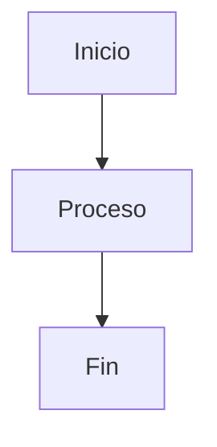

# 📚 Documentación de Atenea

> Plataforma de generación de contenido con IA - Videos e Imágenes

## 🎯 Estructura de Documentación

Esta documentación está organizada en dos secciones principales:

### 📖 **Public** (`docs/public/`)
Documentación visible en la aplicación web (`/docs`). Incluye:
- **API Reference**: Documentación técnica de servicios y endpoints
- **Guía de Usuario**: Tutoriales y guías para usuarios finales

### 🔒 **Private** (`docs/private/`)
Documentación interna solo para desarrolladores. Incluye:
- **Architecture**: Diseño y arquitectura del sistema
- **Development**: Guías de desarrollo, estándares y contribución

---

## 🚀 Acceso Rápido

### Para Usuarios
- **[Guía de Usuario](public/app/GUIA_USUARIO.md)** - Cómo usar la aplicación
- **[API Reference](public/api/README.md)** - Documentación de servicios

### Para Desarrolladores
- **[Arquitectura](private/architecture/README.md)** - Diseño del sistema
- **[Development](private/development/README.md)** - Guías de desarrollo

---

## 📁 Estructura Completa

```
docs/
├── public/              # 📖 Documentación pública (visible en /docs)
│   ├── api/            # API Reference
│   │   ├── services/   # Servicios de IA documentados
│   │   ├── views/      # Vistas y endpoints
│   │   └── README.md   # Índice de API
│   └── app/            # Documentación de la aplicación
│       └── GUIA_USUARIO.md
│
├── private/             # 🔒 Documentación privada (solo devs)
│   ├── architecture/   # Arquitectura del sistema
│   └── development/    # Guías de desarrollo
│
└── README.md          # Este archivo
```

---

## 🔐 Separación Pública/Privada

### ¿Por qué esta separación?

Siguiendo las mejores prácticas de empresas como **HeyGen**, **Stripe** y **GitHub**:

1. **Documentación Pública**: 
   - Visible para todos los usuarios
   - Enfocada en cómo usar la aplicación
   - API reference para integraciones
   - Accesible desde `/docs` en la aplicación

2. **Documentación Privada**:
   - Solo para el equipo de desarrollo
   - Detalles técnicos internos
   - Decisiones de arquitectura
   - Guías de contribución

### Implementación

- Las vistas en `core/views.py` solo leen de `docs/public/`
- La documentación privada solo es accesible desde el repositorio
- El template `docs_template.html` solo muestra contenido público

---

## 📝 Cómo Contribuir

### Agregar Documentación Pública

1. Crea el archivo en `docs/public/api/` o `docs/public/app/`
2. Sigue el formato Markdown estándar
3. Los diagramas Mermaid se renderizan automáticamente
4. La documentación aparecerá en `/docs` automáticamente

### Agregar Documentación Privada

1. Crea el archivo en `docs/private/architecture/` o `docs/private/development/`
2. Esta documentación NO aparecerá en la aplicación web
3. Solo es accesible desde el repositorio

---

## 🎨 Diagramas

La documentación soporta diagramas Mermaid. Ejemplo:

````markdown

````

Los diagramas se renderizan automáticamente en la aplicación web.

---

## 📊 Estado de la Documentación

| Sección | Estado | Ubicación |
|---------|--------|-----------|
| **Guía de Usuario** | ✅ Completa | `public/app/` |
| **API Reference** | ✅ Completa | `public/api/` |
| **Arquitectura** | ✅ Completa | `private/architecture/` |
| **Development** | ✅ Completa | `private/development/` |

---

## 🔗 Enlaces Útiles

- [Guía de Usuario](public/app/GUIA_USUARIO.md)
- [API Reference](public/api/README.md)
- [Arquitectura](private/architecture/README.md)
- [Development Guide](private/development/README.md)

---

**Última actualización**: Noviembre 2024
