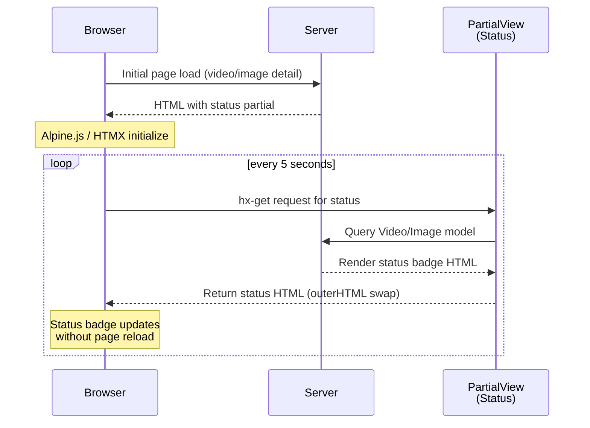
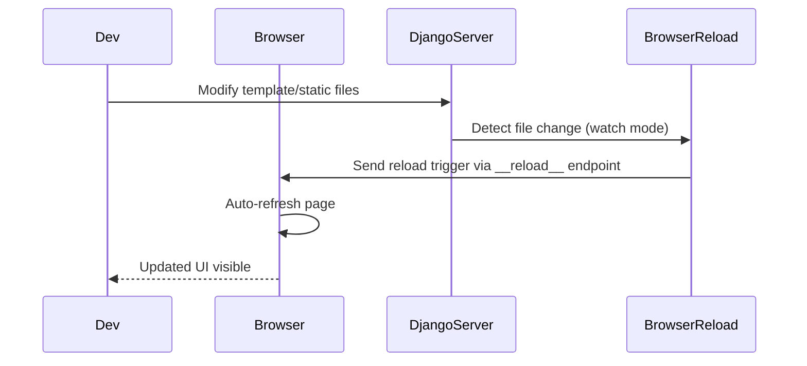

# Frontend Modernization - Atenea

## 📝 Walkthrough

This pull request integrates **Tailwind CSS** with **DaisyUI** components, **Alpine.js**, and **HTMX** into the Django project. A new `theme` app provides static assets and configuration. The settings and URLs are updated for development support via `django-browser-reload`. Two new HTMX partial views enable server-driven status updates. Multiple templates are redesigned with Tailwind utility classes and component patterns, replacing custom CSS and JavaScript with framework-based solutions.

---

## 🔄 Changes

### Settings & Configuration
**Files:** `atenea/settings.py`, `atenea/urls.py`

Added `tailwind`, `theme`, and `django-browser-reload` to `INSTALLED_APPS`; configured Tailwind with `TAILWIND_APP_NAME = 'theme'` and `INTERNAL_IPS`; added hot-reload middleware and conditional URL pattern for development.

---

### Core App Views & Routes
**Files:** `core/urls.py`, `core/views.py`

Introduced two new HTMX partial endpoints:
- `VideoStatusPartialView` 
- `ImageStatusPartialView` 

These enable server-driven status updates without page reloads.

---

### Theme App Boilerplate
**Files:** `theme/admin.py`, `theme/apps.py`, `theme/models.py`, `theme/tests.py`, `theme/views.py`

New Django app scaffolding with standard configuration files and placeholder imports.

---

### Tailwind Configuration & Build
**Files:** 
- `theme/static_src/package.json`
- `theme/static_src/tailwind.config.js`
- `theme/static/css/tailwind.css`

Build scripts, Tailwind config with DaisyUI integration, and compiled CSS stylesheet with:
- Button, card, badge, alert, modal, and stats component classes
- Dark-mode theme support
- Custom utility classes

---

### Base Template & New Partials
**Files:**
- `templates/base.html`
- `templates/partials/confirm_modal.html`
- `templates/partials/image_status.html`
- `templates/partials/video_status.html`

Redesigned base template with:
- Tailwind CSS (CDN)
- Alpine.js for reactive components
- HTMX for AJAX interactions
- Flash message UI
- Responsive navbar
- New partials for modals and HTMX-driven status updates

---

### Dashboard Template
**File:** `templates/dashboard/index.html`

Refactored from CSS-heavy layout to Tailwind-based cards and grids:
- Modern statistics cards with icons
- Grid/list view toggle with Alpine.js
- Responsive design
- Empty states with CTAs

---

### Project Templates
**Files:**
- `templates/projects/create.html`
- `templates/projects/delete.html`
- `templates/projects/detail.html`

Converted to Tailwind styling with:
- Updated form layouts
- Deletion confirmation UI with warnings
- Grid/list views with Alpine.js toggle controls
- Project statistics dashboard

---

### Video Templates
**Files:**
- `templates/videos/delete.html`
- `templates/videos/detail.html`

Replaced legacy CSS and modals with:
- Tailwind cards and components
- Inline status display with auto-updates
- Conditional rendering for processing/error/completed states
- Video player with download functionality

---

### Image Templates
**Files:**
- `templates/images/delete.html`
- `templates/images/detail.html`

Updated with:
- Delete confirmation UI with warnings
- Redesigned detail page with consolidated status
- New image preview region
- Structured sections for metadata, config, and prompt display
- Input images gallery (for image-to-image and multi-image)

---

## 📊 HTMX Status Update Flow



**Key Features:**
- ✅ Auto-refresh every 5 seconds
- ✅ No page reload required
- ✅ Server-driven updates
- ✅ Minimal JavaScript

---

## 🔄 Hot Reload Development Flow



**Benefits:**
- ✅ Instant feedback during development
- ✅ No manual browser refresh needed
- ✅ Works with templates and static files

---

## 🎯 Technology Stack

| Technology | Purpose | Integration |
|------------|---------|-------------|
| **Tailwind CSS** | Utility-first CSS framework | CDN (no build step required) |
| **DaisyUI** | Pre-built component library | Configuration in `tailwind.config.js` |
| **Alpine.js** | Lightweight reactive framework | CDN, used for toggles and modals |
| **HTMX** | AJAX without JavaScript | CDN, used for status updates |
| **django-tailwind** | Django integration | Configured but optional |
| **django-browser-reload** | Hot reload in development | Middleware + URL endpoint |

---

## ✨ Key Improvements

### Before
- ❌ Custom CSS with inconsistent styling
- ❌ Manual JavaScript for interactions
- ❌ No auto-refresh for status updates
- ❌ Non-responsive layouts
- ❌ Heavy maintenance burden

### After
- ✅ Consistent Tailwind-based design
- ✅ Minimal custom JavaScript
- ✅ Auto-updating status badges
- ✅ Fully responsive layouts
- ✅ Easy to maintain and extend
- ✅ Modern, professional appearance

---

## 📦 Dependencies Added

```
django-tailwind==4.2.0
django-browser-reload==1.21.0
python-decouple==3.8
```

**CDN Resources:**
- Tailwind CSS v3.x
- Alpine.js v3.13.5
- HTMX v1.9.10

---

## 🚀 Future Enhancements

- [ ] Install Node.js for full Tailwind build pipeline
- [ ] Enable hot-reload for CSS changes
- [ ] Add more reusable components
- [ ] Implement search with HTMX
- [ ] Add toast notifications
- [ ] Complete dark mode implementation
- [ ] Optimize and minify CSS for production

---

## 📚 Documentation

- **Setup Guide:** [FRONTEND_SETUP_PLAN.md](../FRONTEND_SETUP_PLAN.md)
- **Summary:** [FRONTEND_SETUP_SUMMARY.md](../FRONTEND_SETUP_SUMMARY.md)

---

## 🎨 Component Examples

### Status Badge (HTMX)
```html
<div 
    hx-get="" 
    hx-trigger="every 5s"
    hx-swap="outerHTML">
    <!-- Badge content -->
</div>
```

### View Toggle (Alpine.js)
```html
<div x-data="{ view: 'grid' }">
    <button @click="view = 'grid'">Grid</button>
    <button @click="view = 'list'">List</button>
</div>
```

### Confirmation Modal (Alpine.js)
```html
<div x-data="{ open: false }">
    <button @click="open = true">Delete</button>
    <div x-show="open" class="modal">
        <!-- Modal content -->
    </div>
</div>
```

---

## ✅ Testing Checklist

- [x] Dashboard displays correctly
- [x] Project detail page loads
- [x] Video/Image cards render properly
- [x] Status updates work (HTMX)
- [x] View toggles function (Alpine.js)
- [x] Modals open and close
- [x] Forms submit successfully
- [x] Responsive on mobile
- [x] No console errors
- [x] Navigation works correctly

---

## 🎯 Migration Status

| Template | Status | Notes |
|----------|--------|-------|
| base.html | ✅ Complete | Clean Tailwind implementation |
| dashboard/index.html | ✅ Complete | Stats + cards + toggles |
| projects/detail.html | ✅ Complete | Grid/list views |
| projects/create.html | ✅ Complete | Simple form |
| projects/delete.html | ✅ Complete | Confirmation modal |
| videos/detail.html | ✅ Complete | Player + metadata |
| videos/delete.html | ✅ Complete | Confirmation UI |
| images/detail.html | ✅ Complete | Preview + gallery |
| images/delete.html | ✅ Complete | Confirmation UI |
| videos/create.html | ⏳ Pending | Complex form (1067 lines) |
| images/create.html | ⏳ Pending | Dynamic form fields |

---

*Last updated: October 23, 2025*
