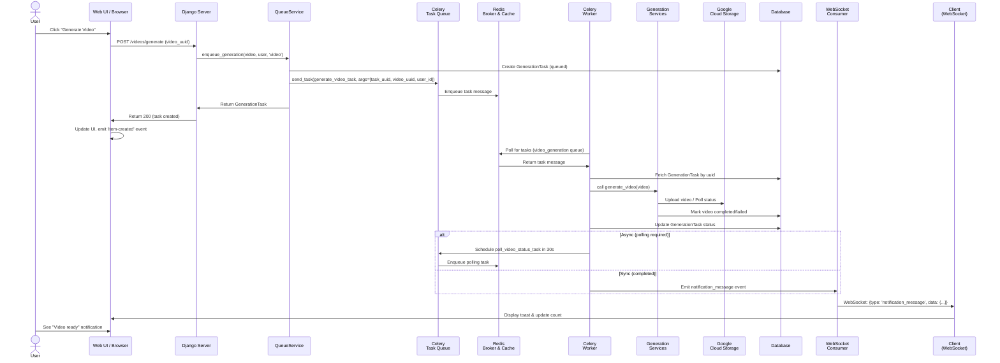
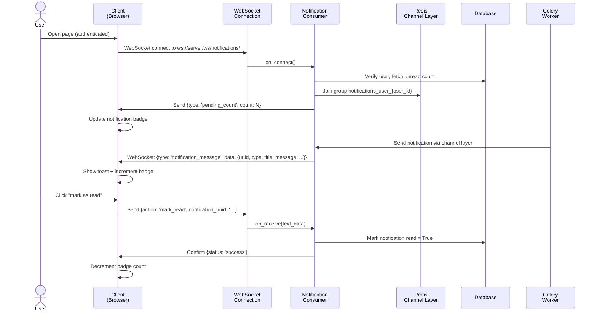

# Sistema de Colas - Arquitectura

## Visión General

El sistema de colas de Atenea utiliza **Celery** con **Redis** como broker para procesar tareas asíncronas de generación de contenido (videos, imágenes, audio). Las notificaciones se envían en tiempo real mediante **WebSockets** (Django Channels).

## Flujo de Generación de Contenido



## Flujo de Notificaciones WebSocket



## Componentes Principales

### QueueService (`core/services/queue.py`)

Servicio central para encolar tareas de generación:

```python
from core.services import QueueService

# Encolar generación de video
task = QueueService.enqueue_generation(
    item=video,
    user=request.user,
    task_type='video',
    priority=5
)
```

### Colas Disponibles

| Cola | Propósito | Prioridad |
|------|-----------|-----------|
| `video_generation` | Videos (Sora, Veo, Kling, etc.) | Alta |
| `image_generation` | Imágenes (Gemini, Freepik, etc.) | Alta |
| `audio_generation` | Audio TTS (ElevenLabs) | Media |
| `scene_processing` | Procesamiento de escenas | Media |
| `polling_tasks` | Polling de APIs asíncronas | Baja |
| `maintenance` | Tareas de mantenimiento | Baja |

### Tasks (`core/tasks.py`)

```python
@shared_task(bind=True, max_retries=3)
def generate_video_task(self, task_uuid, video_uuid, user_id, **kwargs):
    # 1. Marcar como processing
    # 2. Llamar al servicio de generación
    # 3. Crear notificación de éxito/error
    # 4. Manejar reintentos
```

### Modelos

**GenerationTask**: Rastrea el estado de cada tarea
- `uuid`: Identificador único
- `task_id`: ID de Celery (puede ser null inicialmente)
- `status`: queued → processing → completed/failed
- `task_type`: video, image, audio, scene
- `metadata`: JSON con datos adicionales

**Notification**: Notificaciones para usuarios
- `type`: generation_completed, generation_failed, system, info
- `read`: Boolean para marcar como leída
- `action_url`: URL para navegar al recurso

## Configuración

### Django Settings

```python
# Celery
CELERY_BROKER_URL = os.environ.get('REDIS_URL', 'redis://localhost:6379/0')
CELERY_RESULT_BACKEND = CELERY_BROKER_URL

# Channels
CHANNEL_LAYERS = {
    'default': {
        'BACKEND': 'channels_redis.core.RedisChannelLayer',
        'CONFIG': {'hosts': [CELERY_BROKER_URL]},
    },
}
```

### Ejecutar Workers

```bash
# Worker con todas las colas
celery -A atenea worker --loglevel=info \
    --queues=video_generation,image_generation,audio_generation,scene_processing,default,polling_tasks \
    --concurrency=4

# Servidor ASGI con WebSockets
daphne -b 0.0.0.0 -p 8000 atenea.asgi:application
```

## Manejo de Errores

1. **Reintentos automáticos**: Cada task tiene `max_retries=3` con backoff exponencial
2. **Notificaciones de error**: Si falla después de todos los reintentos, se notifica al usuario
3. **Logging**: Todos los errores se registran con `exc_info=True`

## Monitoreo

- **Panel de colas**: `/queues/` muestra tareas activas/pendientes
- **Admin Django**: Gestión de GenerationTask y Notification
- **Logs de Celery**: `--loglevel=info` para debugging

