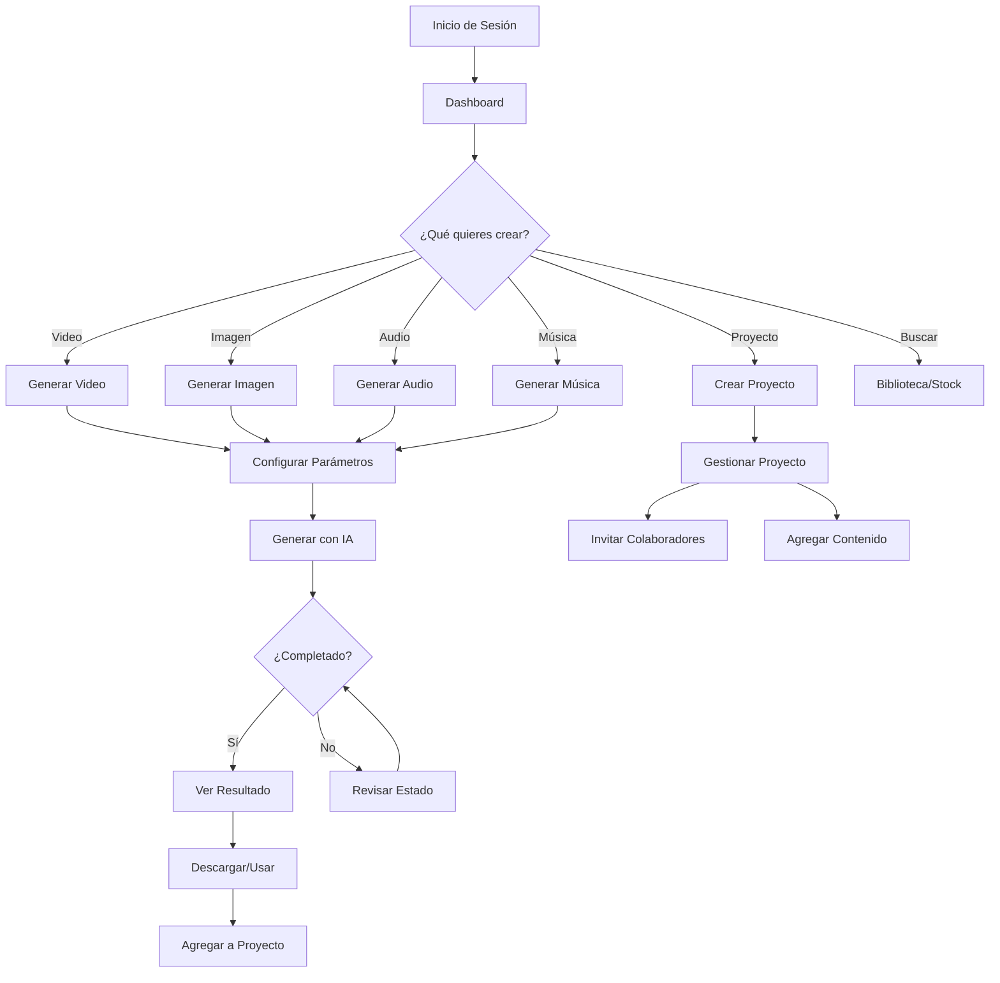
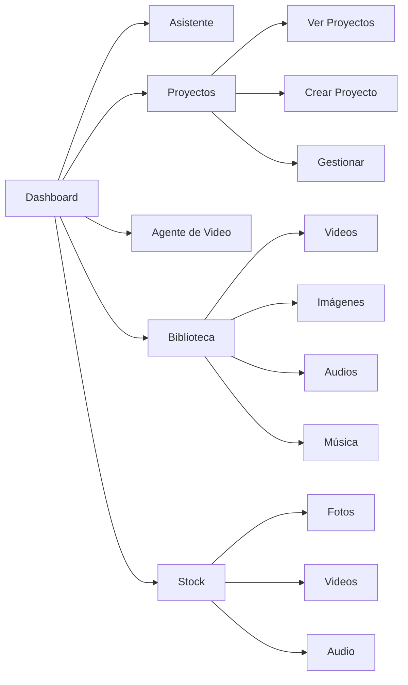
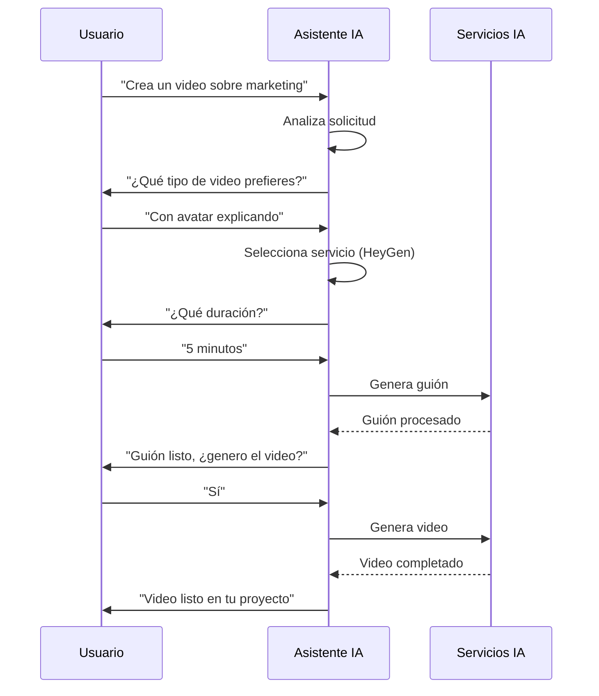
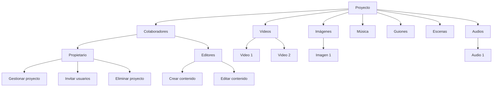
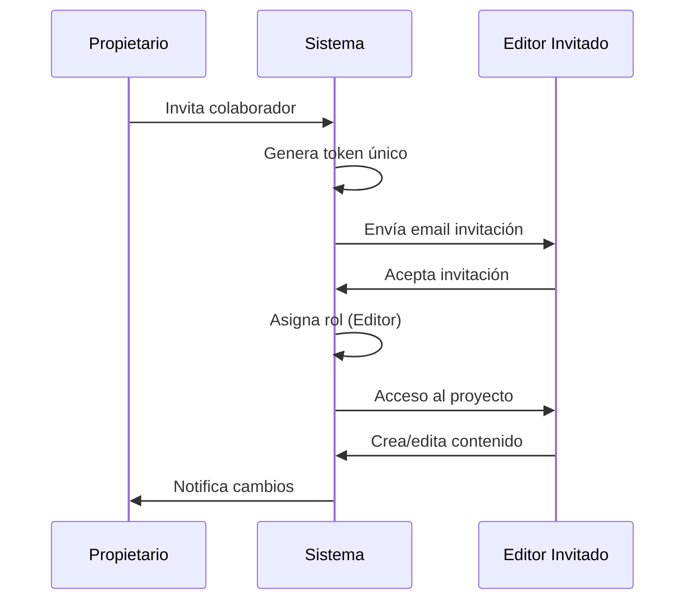
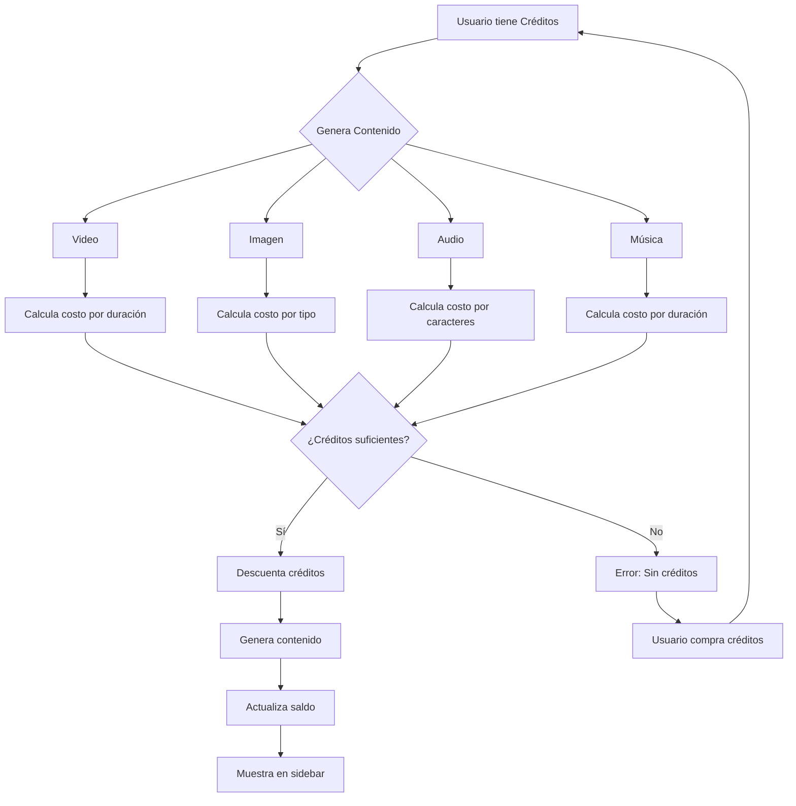

# Guía de Usuario - Atenea

## Introducción

Atenea es una plataforma de generación de contenido con Inteligencia Artificial que te permite crear videos, imágenes, audios y música de forma sencilla. Esta guía te ayudará a entender cómo usar las funciones básicas de la plataforma.

### Flujo General de la Aplicación

---

## Pantalla Principal (Dashboard)

Al iniciar sesión, verás el **Dashboard** con:

- **Barra de búsqueda superior**: Puedes buscar contenido existente o escribir directamente para iniciar una conversación con el asistente de creación.
- **Tarjetas de creación rápida**: Accesos directos para crear diferentes tipos de contenido:
  - Buscar contenido
  - Generar imágenes
  - Generar vídeos
  - Generar audio
  - Generar música
  - Nuevo proyecto
- **Creaciones recientes**: Muestra tus últimos trabajos organizados por fecha.

---

## Navegación

### Estructura de Navegación

### Sidebar (Barra Lateral)

El menú lateral izquierdo contiene:

#### Sección Principal
- **Inicio**: Vuelve al dashboard principal
- **Asistente**: Acceso al chat de creación con IA (Beta)
- **Proyectos**: Gestiona tus proyectos de contenido
- **Agente de Video**: Herramienta avanzada para crear videos complejos (Beta)
- **Biblioteca**: Explora todo tu contenido generado
- **Stock**: Busca imágenes, videos y audio de stock gratuitos y premium

#### Sección Anclados
- **Generar Video**: Acceso rápido a la creación de videos
- **Generar Imagen**: Acceso rápido a la creación de imágenes
- **Generar Audio**: Acceso rápido a la creación de audio
- **Generar Guión**: Acceso rápido a la creación de guiones

#### Sección Inferior
- **Barra de créditos**: Muestra tu saldo actual y uso mensual
- **Ayuda**: Acceso a la documentación
- **Menú de usuario**: Configuración y cierre de sesión

---

## Features Básicos

### 1. Generar Imágenes

**Cómo crear una imagen:**
1. Ve a **Generar Imagen** desde el sidebar o dashboard
2. Escribe un prompt descriptivo de lo que quieres crear
3. Selecciona el tipo de imagen:
   - Texto a Imagen: Crea desde cero con una descripción
   - Imagen a Imagen: Edita una imagen existente
   - Múltiples Imágenes: Crea composiciones con varias imágenes
4. Configura parámetros como relación de aspecto y estilo
5. Haz clic en **Generar**

**Servicios disponibles:**
- Gemini Image (Google)

### 2. Generar Videos

**Cómo crear un video:**
1. Ve a **Generar Video** desde el sidebar o dashboard
2. Escribe el guión o descripción del video
3. Selecciona el tipo de video:
   - **HeyGen Avatar V2/IV**: Videos con avatares hablantes
   - **Gemini Veo**: Videos cinematográficos de alta calidad
   - **Sora**: Videos con efectos y escenas complejas
   - **Kling**: Varias versiones disponibles
   - **Higgsfield**: Múltiples modelos disponibles
   - **Manim Quote**: Videos animados con citas
4. Configura parámetros específicos (avatar, voz, duración, etc.)
5. Haz clic en **Generar**

**Servicios disponibles:**
- Gemini Veo (Google)
- Sora (OpenAI)
- HeyGen Avatar V2 e IV
- Vuela.ai
- Kling (múltiples versiones)
- Higgsfield (múltiples modelos)

### 3. Generar Audio

**Cómo crear audio:**
1. Ve a **Generar Audio** desde el sidebar o dashboard
2. Escribe el texto que quieres convertir a voz
3. Selecciona la voz de ElevenLabs
4. Configura parámetros de voz (estabilidad, velocidad, estilo)
5. Selecciona el idioma
6. Haz clic en **Generar**

**Servicios disponibles:**
- ElevenLabs Text-to-Speech (TTS)

### 4. Generar Música

**Cómo crear música:**
1. Ve a **Generar Música** desde el dashboard
2. Escribe un prompt descriptivo del estilo musical que deseas
3. Configura la duración deseada
4. Haz clic en **Generar**

**Servicios disponibles:**
- ElevenLabs Music

### 5. Generar Guiones

**Cómo crear un guión:**
1. Ve a **Generar Guión** desde el sidebar o dashboard
2. Escribe el contenido o tema del guión
3. Indica la duración deseada del video final
4. El sistema procesará el guión y lo dividirá en escenas
5. Revisa y edita las escenas generadas

---

## Servicios Disponibles

### Servicios de Video

| Servicio | Descripción | Uso Recomendado |
|----------|-------------|-----------------|
| **Gemini Veo** | Videos cinematográficos de alta calidad | B-roll, paisajes, escenas generales |
| **Sora** | Videos con efectos y escenas complejas | Acción, efectos especiales, contenido dinámico |
| **HeyGen Avatar V2/IV** | Videos con avatares hablantes | Presentaciones, explicaciones, contenido educativo |
| **Vuela.ai** | Videos animados | Contenido creativo y animaciones |
| **Kling** | Múltiples versiones disponibles | Varios tipos de contenido según versión |
| **Higgsfield** | Múltiples modelos disponibles | Contenido especializado según modelo |

### Servicios de Imagen

| Servicio | Descripción |
|----------|-------------|
| **Gemini Image** | Generación de imágenes desde texto |

### Servicios de Audio

| Servicio | Descripción |
|----------|-------------|
| **ElevenLabs TTS** | Conversión de texto a voz con múltiples voces |
| **ElevenLabs Music** | Generación de música con IA |

---

## El Agente de Creación

El **Asistente** es un chat inteligente que te ayuda a crear contenido de forma conversacional.

### Flujo del Asistente

### Cómo usar el Asistente:

1. Haz clic en **Asistente** en el sidebar
2. Escribe lo que quieres crear (ej: "Crea un video sobre marketing digital")
3. El asistente te guiará paso a paso:
   - Te ayudará a definir el contenido
   - Sugerirá servicios apropiados
   - Te ayudará a configurar parámetros
   - Creará el contenido automáticamente

### Características:
- Conversación natural en español
- Sugerencias inteligentes de servicios
- Creación automática de contenido
- Integración con todos los servicios disponibles

---

## Proyectos

Los **Proyectos** te permiten organizar tu contenido de forma estructurada.

### Estructura de Proyectos

### Crear un Proyecto:

1. Haz clic en **Nuevo Proyecto** en el sidebar o dashboard
2. Ingresa un nombre para el proyecto
3. Haz clic en **Crear**

### Gestión de Proyectos:

- **Ver proyecto**: Haz clic en cualquier proyecto para ver su contenido
- **Editar nombre**: Desde la vista de detalle del proyecto
- **Eliminar proyecto**: Desde el menú de acciones del proyecto
- **Mover contenido**: Puedes mover videos, imágenes y audios entre proyectos

### Contenido en Proyectos:

Cada proyecto muestra:
- **Videos**: Todos los videos asociados
- **Imágenes**: Todas las imágenes asociadas
- **Audios**: Todos los audios asociados
- **Música**: Todas las pistas musicales asociadas
- **Guiones**: Todos los guiones procesados
- **Agente**: Escenas y configuración del agente de video

---

## Grupos y Colaboración

### Flujo de Colaboración

### Invitar Colaboradores:

1. Abre un proyecto
2. Haz clic en **Invitar** o **Compartir**
3. Ingresa el email del colaborador
4. Selecciona el rol:
   - **Propietario**: Control total del proyecto
   - **Editor**: Puede editar y crear contenido
5. El colaborador recibirá una invitación por email

### Roles:

- **Propietario**: Puede editar, eliminar y gestionar colaboradores
- **Editor**: Puede crear y editar contenido, pero no eliminar el proyecto

### Ver Colaboradores:

En la vista de proyecto verás:
- Avatar del propietario
- Avatares de los colaboradores
- Contador de colaboradores adicionales

---

## Stock (Contenido Stock)

La sección **Stock** te permite buscar y descargar contenido gratuito y premium.

### Tipos de Contenido:

- **Fotos**: Imágenes y fotografías
- **Videos**: Videos de stock
- **Audio**: Música y efectos de sonido

### Fuentes Disponibles:

- **Freepik**: Imágenes, vectores, videos y audio (gratis y premium)
- **Pexels**: Fotos y videos gratuitos
- **Unsplash**: Fotos gratuitas de alta calidad
- **Pixabay**: Fotos, videos y música gratuitos
- **Freesound**: Efectos de sonido gratuitos

### Cómo usar Stock:

1. Ve a **Stock** en el sidebar
2. Selecciona el tipo de contenido (Fotos/Videos/Audio)
3. Busca usando palabras clave
4. Filtra por:
   - Fuente (Freepik, Pexels, etc.)
   - Orientación (horizontal, vertical, cuadrada)
   - Licencia (gratis o premium)
5. Descarga o mueve a un proyecto

### Vistas:

- **Cuadrícula**: Vista de miniaturas
- **Vista única**: Vista ampliada con navegación por teclado (flechas)

---

## Sistema de Créditos

### Flujo de Créditos

### Ver tus Créditos:

Tu saldo de créditos se muestra en la parte inferior del sidebar:
- **Saldo actual**: Créditos disponibles
- **Uso mensual**: Barra de progreso del consumo del mes
- **Créditos restantes**: Cuántos créditos te quedan este mes

### Cómo se Consumen Créditos:

Cada servicio consume créditos según:
- **Videos**: Duración y tipo de servicio
- **Imágenes**: Tipo de generación
- **Audio**: Número de caracteres del texto
- **Música**: Duración generada

### Ver Detalles:

Haz clic en la barra de créditos para ver:
- Historial de transacciones
- Uso por servicio
- Estadísticas de consumo

---

## Biblioteca

La **Biblioteca** muestra todo tu contenido generado.

### Características:

- **Búsqueda**: Busca por título, tipo o contenido
- **Filtros**: Filtra por tipo (video, imagen, audio)
- **Vista de tarjetas**: Cada item muestra:
  - Miniatura o preview
  - Título
  - Estado (pendiente, procesando, completado, error)
  - Fecha de creación
  - Proyecto asociado (si aplica)

### Acciones Disponibles:

- **Ver detalle**: Haz clic en cualquier item
- **Descargar**: Descarga el contenido generado
- **Eliminar**: Elimina contenido no deseado
- **Mover a proyecto**: Asigna contenido a un proyecto

---

## Consejos y Mejores Prácticas

### Para Videos:

- **HeyGen**: Ideal para videos educativos o explicativos con avatares
- **Gemini Veo**: Perfecto para b-roll cinematográfico y paisajes
- **Sora**: Mejor para escenas con acción y efectos especiales
- Escribe guiones claros y descriptivos
- Considera la duración antes de generar

### Para Imágenes:

- Sé específico en tus prompts
- Indica estilo, colores y composición deseada
- Usa referencias visuales cuando sea posible

### Para Audio:

- Revisa la pronunciación de palabras técnicas
- Prueba diferentes voces antes de generar contenido largo
- Ajusta la velocidad según el contexto

### Organización:

- Crea proyectos temáticos
- Usa nombres descriptivos para tu contenido
- Organiza por cliente, campaña o tipo de contenido

---

## Solución de Problemas

### El contenido no se genera:

1. Verifica que tengas créditos suficientes
2. Revisa que los parámetros sean correctos
3. Intenta con un prompt más simple
4. Revisa el estado en la biblioteca

### Error en la generación:

1. Revisa el mensaje de error en el detalle del item
2. Verifica la configuración del servicio
3. Intenta regenerar con parámetros diferentes
4. Contacta al soporte si el problema persiste

### No puedo ver mi contenido:

1. Verifica que esté en estado "Completado"
2. Revisa los filtros en la biblioteca
3. Asegúrate de estar en el proyecto correcto

---

## Atajos de Teclado

- **Flechas izquierda/derecha**: Navegar entre items en vista única de Stock
- **Escape**: Salir de vista única en Stock
- **Enter**: Buscar o enviar mensaje en el asistente

---

## Soporte

Para más ayuda:
- Consulta la documentación técnica en `/docs/`
- Usa el asistente de documentación desde el sidebar
- Contacta al administrador del sistema

---

## Glosario

- **Prompt**: Descripción textual de lo que quieres generar
- **Avatar**: Personaje virtual que habla en videos
- **B-roll**: Material de apoyo visual en videos
- **TTS**: Text-to-Speech (Texto a Voz)
- **Stock**: Contenido pre-generado disponible para descarga
- **Créditos**: Moneda virtual para consumir servicios de IA

---

*Última actualización: 2024*

