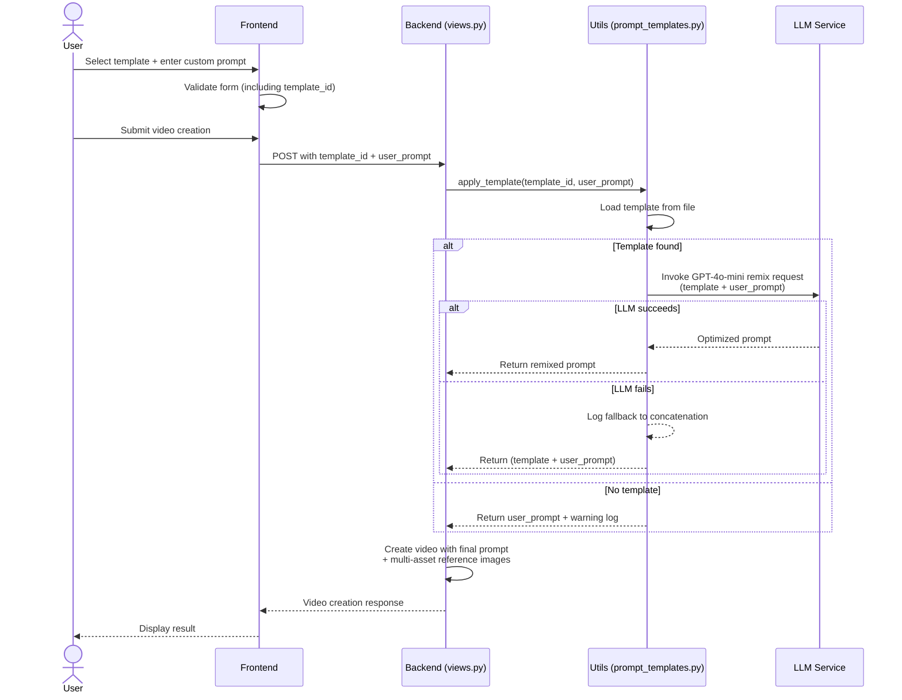

# Sistema de Prompt Templates

El sistema de Prompt Templates permite crear plantillas reutilizables con variables dinámicas que se combinan automáticamente con el prompt del usuario usando LLM remixing.

## 🎯 Concepto

En lugar de escribir prompts completos cada vez, puedes usar templates predefinidos con variables como `{starting_subject}`, `{location}`, `{visual_style}`, etc. El sistema combina automáticamente el template con tu prompt personalizado usando GPT-4o-mini para crear un prompt final optimizado.

## 🔄 Flujo del Sistema



## ✨ Características

### 1. Variables Dinámicas

Los templates pueden incluir variables entre llaves que se rellenan automáticamente:

```markdown
Continuous Earth zoom-out starting from {starting_subject} in {location}.

Camera {camera_movement}, never losing the center point...
```

### 2. LLM Remixing

El sistema usa GPT-4o-mini para:
- **Combinar** el template con el prompt del usuario
- **Traducir** todo al mismo idioma del usuario
- **Optimizar** el prompt final para mejor generación
- **Filtrar** contenido sensible (nombres famosos, marcas, etc.)

### 3. Proceso Transparente

- El usuario solo selecciona un template y escribe su prompt
- El remixing ocurre automáticamente en el backend
- No hay feedback adicional necesario para el usuario
- Todo sucede dentro del flujo de generación normal

### 4. Fallback Seguro

Si el LLM remixing falla, el sistema usa concatenación simple:
```
{template_text}\n\n{user_prompt}
```

## 📝 Crear un Template

Los templates se almacenan en `core/prompt_templates/default/video/` como archivos Markdown.

### Estructura del Template

```markdown
---
name: Nombre del Template
description: Descripción breve
recommended_service: gemini_veo
is_public: true
---

Tu template aquí con {variables}.

Puedes usar múltiples líneas y {otra_variable}.
```

### Ejemplo: Earth Zoom-Out Cinematic

```markdown
---
name: Earth Zoom-Out Cinematic
description: Continuous Earth zoom-out video, starting from a specific subject and location, transitioning to a full Earth view.
recommended_service: gemini_veo
is_public: true
---

Continuous Earth zoom-out starting from {starting_subject} in {location}.

Camera {camera_movement}, never losing the center point, very fluid no big cuts, just one camera continuous movement.

{speed_description}.

{visual_style}, one single unbroken shot.

No cuts, no text, no music.
```

## 🎨 Usar Templates en la UI

1. **Seleccionar Template**: En el formulario de creación de video, selecciona un template del dropdown
2. **Escribir Prompt**: Escribe tu prompt personalizado (ej: "man dancing on a field")
3. **Generar**: El sistema combinará automáticamente el template con tu prompt

### Ejemplo de Uso

**Template seleccionado**: Earth Zoom-Out Cinematic  
**Prompt del usuario**: "man dancing on a field"

**Prompt final generado** (después del remixing):
```
Continuous Earth zoom-out starting from a man dancing in a vibrant green field under a clear blue sky.

Camera gliding smoothly across the landscape, never losing the center point, very fluid no big cuts, just one camera continuous movement.

Gradually increasing speed to create a sense of wonder and freedom.

Cinematic visual style, one single unbroken shot.

No cuts, no text, no music.
```

## 🔍 Logs y Debugging

El sistema genera logs detallados del proceso:

```
🎬 APLICANDO TEMPLATE: Earth Zoom-Out Cinematic (UUID: ...)
📝 TEMPLATE ORIGINAL:
[contenido del template]

👤 PROMPT DEL USUARIO:
man dancing on a field

✅ PROMPT FINAL (LLM REMIX):
[prompt final optimizado]

📊 Estadísticas: Template=286 chars, User=22 chars, Final=391 chars
```

## 🛡️ Filtrado de Contenido

El sistema automáticamente filtra:
- ❌ Nombres de personas famosas → Reemplazados con descripciones genéricas
- ❌ Marcas comerciales → Reemplazadas con términos genéricos
- ❌ Contenido violento/sexual → Filtrado
- ❌ Referencias políticas/religiosas específicas → Generalizadas

## 🌍 Traducción Automática

El sistema detecta el idioma del prompt del usuario y traduce todo el template al mismo idioma:

- **Usuario escribe en español** → Todo el prompt final en español
- **Usuario escribe en inglés** → Todo el prompt final en inglés
- **Usuario escribe en otro idioma** → Todo traducido a ese idioma

## ⚙️ Configuración Técnica

### Archivos Clave

- **`core/utils/prompt_templates.py`**: Lógica de aplicación y remixing
- **`core/prompt_templates/default/video/`**: Templates almacenados
- **`core/views.py`**: Integración con el flujo de generación
- **`templates/includes/creation_sidebar.html`**: UI de selección de templates

### Modelo LLM

- **Modelo**: GPT-4o-mini
- **Temperatura**: 0.7
- **Max Tokens**: 1000
- **Provider**: OpenAI

### Base de Datos

Los templates se almacenan en la tabla `PromptTemplate` con:
- `uuid`: Identificador único
- `name`: Nombre del template
- `prompt_text`: Contenido del template
- `is_active`: Si está activo o no
- `usage_count`: Contador de uso

## 🚀 Ventajas

1. **Consistencia**: Prompts estructurados y optimizados
2. **Eficiencia**: No necesitas escribir prompts largos cada vez
3. **Calidad**: LLM remixing optimiza el prompt final
4. **Flexibilidad**: Variables permiten personalización
5. **Seguridad**: Filtrado automático de contenido sensible
6. **Internacionalización**: Traducción automática

## 📚 Templates Disponibles

- **Earth Zoom-Out Cinematic**: Zoom-out continuo desde un sujeto hasta la vista completa de la Tierra

¿Quieres crear tu propio template? Consulta la [guía de desarrollo](../private/development/ADDING_NEW_MODELS.md) para más detalles.

---

**Última actualización**: Diciembre 2024

