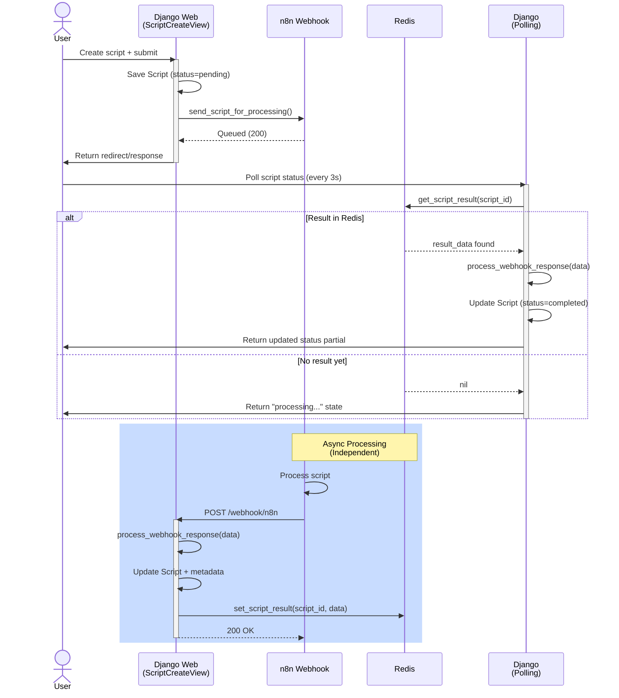

# Script Management Feature

## Descripción General

Este pull request introduce una funcionalidad completa de gestión de guiones con integración de webhook n8n y polling de resultados basado en Redis. Añade modelos, formularios, servicios, vistas y plantillas para crear, procesar y gestionar guiones, mientras elimina archivos de configuración de Tailwind CSS y simplifica la configuración de base de datos a solo SQLite.

## Changes

| Categoría / Archivos | Resumen |
|----------------------|---------|
| **Script Model & Migrations** `core/migrations/0005_script.py` `core/migrations/0006_script_desired_duration_min.py` `core/models.py` | Nuevo modelo Script con ciclo de vida de estados (pending/processing/completed/error), timestamps y campos de metadata; propiedades añadidas a Project para conteo de scripts; introducción de la constante SCRIPT_STATUS; migraciones crean la tabla y añaden el campo desired_duration_min. |
| **Script Forms & Data Handling** `core/forms.py` | Nuevo ScriptForm con campos title, original_script y desired_duration_min; incluye validación, widgets, labels y textos de ayuda. |
| **Integration Services** `core/services.py` | Añadido N8nService para comunicación webhook con n8n y RedisService para caché de resultados; importación del modelo Script para referencias de tipo. |
| **Script URL Routing** `core/urls.py` | Nuevas rutas para operaciones CRUD de scripts (create, detail, delete, retry), partial HTMX de estado, y endpoint webhook de n8n. |
| **Script Views & Webhooks** `core/views.py` | Cinco nuevas vistas de script (create, detail, delete, retry, status partial) con soporte HTMX; N8nWebhookView para manejo de webhooks; contextos de dashboard y detalle de proyecto extendidos con métricas de scripts; polling de Redis para actualizaciones de estado. |
| **Script Templates** `templates/partials/script_actions.html` `templates/partials/script_status.html` `templates/scripts/create.html` `templates/scripts/create_modal.html` `templates/scripts/delete.html` `templates/scripts/detail.html` | Plantillas de visualización e interacción para scripts; badges de estado, botones de acción, contadores de caracteres, manejo de formularios y UI de expansión de escenas. |
| **Project Detail & Templates** `templates/projects/detail.html` | Añadida tarjeta de métricas de scripts, sección de scripts con toggle grid/list, botón de crear guión y estado vacío condicional. |
| **Settings & Environment** `atenea/settings.py` `env.example` | Base de datos simplificada a solo SQLite; añadida configuración de Redis (REDIS_URL, REDIS_PASSWORD); configuración de logging expandida con handlers de archivo y consola. |
| **Git Configuration** `.gitignore` | Añadidos patrones de ignore para .cursor y .cursorrules. |
| **Removed Build Configuration** `theme/static/css/tailwind.css` `theme/static_src/package.json` `theme/static_src/tailwind.config.js` | Eliminado pipeline de build de Tailwind CSS, incluyendo estilos compilados, configuración npm y config de Tailwind. |

## Flujo de Procesamiento de Scripts

## Características Principales

- **Gestión completa de guiones**: CRUD completo para scripts con estados de procesamiento
- **Integración n8n**: Webhook bidireccional para procesamiento asíncrono
- **Redis para caché**: Sistema de polling eficiente para actualizaciones en tiempo real
- **HTMX**: Actualizaciones parciales de UI sin recargar página
- **Validación robusta**: Formularios con validación de campos y límites de caracteres
